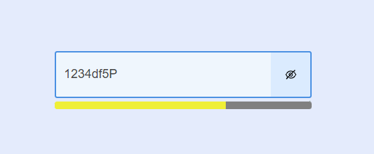

# Password Strength Checker

## Project Overview

The purpose of this project is to create a password input field with a real-time visual indicator showing the strength of the entered password. The strength of the password is calculated based on specific criteria, and the results are displayed in three colored sections below the input field.

## Features

- Password input field with toggle visibility button
- Real-time password strength calculation
- Visual indicator showing password strength with colored sections
- Strength calculation based on combination of characters (letters, digits, symbols)

## Password Strength Criteria

- Empty Field: All sections are gray.
- Password Length < 8 characters: All sections are red.
- Easy Password (only letters/digits/symbols): The first section is red, the remaining sections are gray.
- Medium Password (combination of letters-symbols, letters-digits, or digits-symbols): The first two sections are yellow, the last section is gray.
- Strong Password (combination of letters, symbols, and numbers): All sections are green.

## Usage

- Password Input: Enter a password in the input field. The visibility can be toggled using the button.
- Password Strength Indicator: Observe the colored sections below the input field that indicate the strength of the password.
